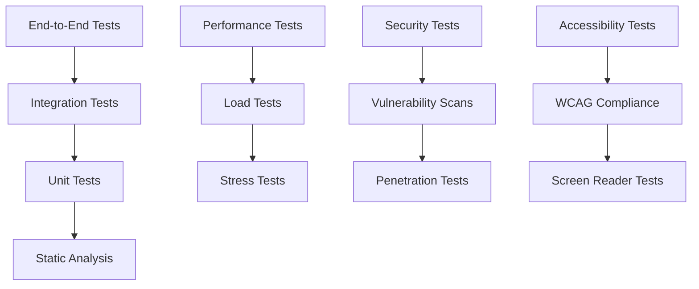

# Design Document

## Overview

The comprehensive test suite enhancement will transform the current basic testing infrastructure into a production-ready, multi-layered testing system. The design follows industry best practices for test automation, incorporating modern testing frameworks, comprehensive coverage analysis, and automated quality gates.

The enhanced test suite will be organized into distinct layers (unit, integration, end-to-end, performance, security) with shared utilities, fixtures, and reporting mechanisms. Each layer serves specific quality assurance needs while maintaining fast feedback loops for developers.

## Architecture

### Test Pyramid Structure



### Test Organization Structure

```
tests/
├── unit/                           # Fast, isolated unit tests
│   ├── cads/                      # CADS module unit tests
│   ├── visualization/             # Frontend unit tests
│   ├── database/                  # Database layer unit tests
│   └── utils/                     # Utility function tests
├── integration/                   # Component integration tests
│   ├── pipeline/                  # ML pipeline integration
│   ├── api/                       # API endpoint integration
│   └── database/                  # Database integration
├── e2e/                          # End-to-end user scenarios
│   ├── user_workflows/           # Complete user journeys
│   ├── browser_tests/            # Cross-browser testing
│   └── accessibility/            # Accessibility compliance
├── performance/                  # Performance and load tests
│   ├── load/                     # Load testing scenarios
│   ├── stress/                   # Stress testing
│   └── benchmarks/               # Performance benchmarks
├── security/                     # Security-focused tests
│   ├── vulnerability/            # Vulnerability scanning
│   ├── authentication/           # Auth security tests
│   └── data_protection/          # Data security tests
├── fixtures/                     # Shared test data and utilities
│   ├── data/                     # Test datasets
│   ├── mocks/                    # Mock objects and services
│   └── generators/               # Test data generators
├── utils/                        # Test utilities and helpers
│   ├── assertions/               # Custom assertion helpers
│   ├── matchers/                 # Custom test matchers
│   └── reporters/                # Custom test reporters
└── config/                       # Test configuration
    ├── pytest.ini               # Pytest configuration
    ├── coverage.ini              # Coverage configuration
    └── ci/                       # CI-specific configurations
```

## Components and Interfaces

### Test Framework Stack

#### Core Testing Framework
- **pytest**: Primary test runner with extensive plugin ecosystem
- **pytest-cov**: Coverage reporting and analysis
- **pytest-xdist**: Parallel test execution
- **pytest-mock**: Enhanced mocking capabilities
- **pytest-html**: HTML test reporting

#### Frontend Testing
- **Playwright**: Modern browser automation for E2E tests
- **axe-core**: Accessibility testing integration
- **jest**: JavaScript unit testing framework
- **testing-library**: DOM testing utilities

#### Performance Testing
- **locust**: Load testing framework
- **memory-profiler**: Memory usage analysis
- **py-spy**: Performance profiling
- **pytest-benchmark**: Performance benchmarking

#### Security Testing
- **bandit**: Python security linting
- **safety**: Dependency vulnerability scanning
- **sqlmap**: SQL injection testing
- **owasp-zap**: Web application security testing

### Test Data Management

#### Fixture System
```python
# fixtures/base.py
@pytest.fixture(scope="session")
def test_database():
    """Provides isolated test database instance"""
    
@pytest.fixture(scope="function")
def sample_research_data():
    """Generates sample research data for tests"""
    
@pytest.fixture(scope="module")
def ml_models():
    """Provides pre-trained test ML models"""
```

#### Mock Services
```python
# mocks/services.py
class MockOpenAlexAPI:
    """Mock OpenAlex API for testing"""
    
class MockDatabaseConnection:
    """Mock database connection for unit tests"""
    
class MockEmbeddingModel:
    """Mock sentence transformer model"""
```

#### Test Data Generators
```python
# generators/research_data.py
class ResearchDataGenerator:
    def generate_papers(self, count: int) -> List[Dict]
    def generate_researchers(self, count: int) -> List[Dict]
    def generate_embeddings(self, dimensions: int) -> np.ndarray
```

### Test Execution Engine

#### Test Runner Configuration
```python
# config/test_runner.py
class TestRunner:
    def __init__(self):
        self.categories = {
            'unit': {'timeout': 30, 'parallel': True},
            'integration': {'timeout': 300, 'parallel': False},
            'e2e': {'timeout': 600, 'parallel': False},
            'performance': {'timeout': 1800, 'parallel': False},
            'security': {'timeout': 900, 'parallel': True}
        }
    
    def run_category(self, category: str, **kwargs):
        """Execute specific test category with appropriate configuration"""
```

#### Parallel Execution Strategy
- **Unit Tests**: High parallelization (8+ workers)
- **Integration Tests**: Limited parallelization (2-4 workers)
- **E2E Tests**: Sequential execution to avoid conflicts
- **Performance Tests**: Isolated execution with resource monitoring
- **Security Tests**: Parallel execution with rate limiting

## Data Models

### Test Result Schema
```python
@dataclass
class TestResult:
    test_id: str
    category: str
    status: str  # passed, failed, skipped, error
    duration: float
    coverage: Optional[float]
    memory_usage: Optional[int]
    error_message: Optional[str]
    artifacts: List[str]  # Screenshots, logs, reports
```

### Coverage Report Schema
```python
@dataclass
class CoverageReport:
    overall_coverage: float
    module_coverage: Dict[str, float]
    missing_lines: Dict[str, List[int]]
    branch_coverage: float
    complexity_metrics: Dict[str, int]
```

### Performance Metrics Schema
```python
@dataclass
class PerformanceMetrics:
    response_time_p95: float
    throughput: float
    memory_peak: int
    cpu_usage: float
    error_rate: float
    concurrent_users: int
```

## Error Handling

### Test Failure Classification
```python
class TestFailureClassifier:
    CATEGORIES = {
        'assertion_error': 'Logic or expectation mismatch',
        'timeout_error': 'Performance or hanging issue',
        'connection_error': 'Infrastructure or network issue',
        'import_error': 'Dependency or environment issue',
        'data_error': 'Test data or fixture issue'
    }
    
    def classify_failure(self, exception: Exception) -> str:
        """Classify test failure for better debugging"""
```

### Retry Mechanisms
```python
@pytest.mark.flaky(reruns=3, reruns_delay=2)
def test_network_dependent_feature():
    """Automatically retry flaky network-dependent tests"""
```

### Error Recovery Strategies
- **Database Tests**: Automatic rollback and cleanup
- **Browser Tests**: Screenshot capture on failure
- **Performance Tests**: Resource cleanup and monitoring reset
- **Integration Tests**: Service state restoration

## Testing Strategy

### Unit Testing Approach
- **Isolation**: Each test runs independently with mocked dependencies
- **Speed**: Complete unit test suite runs in under 30 seconds
- **Coverage**: Minimum 85% line coverage, 80% branch coverage
- **Mocking**: Comprehensive mocking of external services and databases

### Integration Testing Approach
- **Component Integration**: Test interactions between system components
- **Database Integration**: Validate data flow and consistency
- **API Integration**: Test endpoint behavior and error handling
- **Service Integration**: Validate external service interactions

### End-to-End Testing Approach
- **User Scenarios**: Test complete user workflows from start to finish
- **Cross-Browser**: Validate functionality across major browsers
- **Responsive Design**: Test on multiple device sizes and orientations
- **Accessibility**: Ensure compliance with WCAG 2.1 AA standards

### Performance Testing Strategy
- **Load Testing**: Simulate realistic user loads (10-100 concurrent users)
- **Stress Testing**: Test system limits and failure points
- **Benchmark Testing**: Track performance trends over time
- **Memory Testing**: Monitor memory usage and detect leaks

### Security Testing Framework
- **Static Analysis**: Automated code scanning for security vulnerabilities
- **Dynamic Testing**: Runtime security testing with simulated attacks
- **Dependency Scanning**: Regular checks for vulnerable dependencies
- **Penetration Testing**: Simulated attack scenarios

## Quality Gates and Metrics

### Automated Quality Gates
```python
class QualityGates:
    THRESHOLDS = {
        'unit_test_coverage': 85.0,
        'integration_test_pass_rate': 95.0,
        'performance_regression_threshold': 10.0,  # percent
        'security_vulnerability_count': 0,
        'accessibility_violations': 0
    }
    
    def evaluate_quality(self, test_results: TestResults) -> bool:
        """Determine if quality gates pass for deployment"""
```

### Continuous Monitoring
- **Test Trend Analysis**: Track test stability and performance over time
- **Coverage Trend Monitoring**: Ensure coverage doesn't regress
- **Performance Baseline Tracking**: Monitor for performance regressions
- **Flaky Test Detection**: Identify and address unstable tests

## Reporting and Analytics

### Test Report Generation
```python
class TestReportGenerator:
    def generate_html_report(self, results: TestResults) -> str:
        """Generate comprehensive HTML test report"""
    
    def generate_coverage_report(self, coverage_data: CoverageData) -> str:
        """Generate detailed coverage analysis report"""
    
    def generate_performance_report(self, metrics: PerformanceMetrics) -> str:
        """Generate performance analysis report"""
```

### Dashboard Integration
- **Real-time Test Status**: Live dashboard showing current test status
- **Historical Trends**: Graphs showing quality metrics over time
- **Failure Analysis**: Detailed breakdown of test failures and patterns
- **Performance Tracking**: Performance metrics visualization and alerts

## CI/CD Integration

### GitHub Actions Workflow
```yaml
name: Comprehensive Test Suite
on: [push, pull_request]

jobs:
  unit-tests:
    runs-on: ubuntu-latest
    steps:
      - name: Run Unit Tests
        run: pytest tests/unit/ --cov --html=reports/unit.html
  
  integration-tests:
    needs: unit-tests
    runs-on: ubuntu-latest
    services:
      postgres:
        image: postgres:13
        env:
          POSTGRES_PASSWORD: test
    steps:
      - name: Run Integration Tests
        run: pytest tests/integration/ --html=reports/integration.html
  
  e2e-tests:
    needs: integration-tests
    runs-on: ubuntu-latest
    steps:
      - name: Run E2E Tests
        run: pytest tests/e2e/ --html=reports/e2e.html
  
  performance-tests:
    needs: integration-tests
    runs-on: ubuntu-latest
    steps:
      - name: Run Performance Tests
        run: pytest tests/performance/ --html=reports/performance.html
  
  security-tests:
    runs-on: ubuntu-latest
    steps:
      - name: Run Security Tests
        run: pytest tests/security/ --html=reports/security.html
```

### Quality Gate Enforcement
- **PR Checks**: Automated quality gate validation on pull requests
- **Deployment Blocking**: Prevent deployments that fail quality gates
- **Notification System**: Alert teams when quality gates fail
- **Rollback Triggers**: Automatic rollback on critical test failures

## Implementation Phases

### Phase 1: Foundation (Weeks 1-2)
- Set up enhanced test framework and structure
- Implement core fixtures and utilities
- Create basic unit test coverage
- Establish CI/CD integration

### Phase 2: Core Testing (Weeks 3-4)
- Implement comprehensive unit tests
- Add integration test suite
- Set up performance testing framework
- Implement basic security tests

### Phase 3: Advanced Testing (Weeks 5-6)
- Add end-to-end test suite
- Implement accessibility testing
- Add comprehensive performance benchmarks
- Enhance security testing coverage

### Phase 4: Optimization (Weeks 7-8)
- Optimize test execution performance
- Implement advanced reporting and analytics
- Fine-tune quality gates and thresholds
- Add monitoring and alerting systems