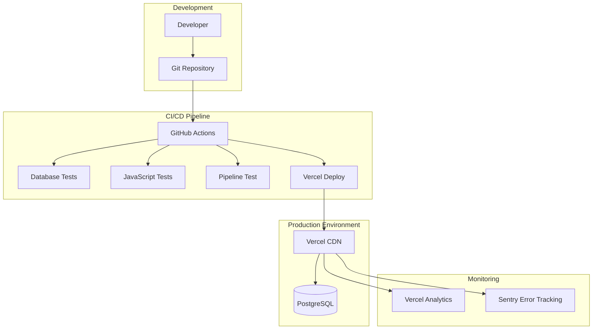

# Design Document

## Overview

The Sustainable CI/CD System design creates a streamlined, production-ready platform focused on essential testing, monitoring, and deployment automation. The architecture emphasizes simplicity, reliability, and maintainability using GitHub Actions, Vercel Analytics, and Sentry for comprehensive coverage without complexity.

## Architecture

### Simplified System Architecture



### Technology Stack

#### CI/CD Platform
- **GitHub Actions** - Primary CI/CD orchestration
- **Vercel** - Frontend deployment and CDN

#### Testing Framework
- **Python**: pytest for database and pipeline testing
- **JavaScript**: Built-in browser testing for visualization validation
- **Database**: Direct PostgreSQL testing with existing test infrastructure

#### Monitoring and Observability
- **Vercel Analytics** - Performance and usage monitoring
- **Sentry** - Error tracking and performance monitoring
- **GitHub Actions** - CI/CD pipeline monitoring

## Components and Interfaces

### 1. CI/CD Pipeline Components

#### GitHub Actions Workflow

**Main Workflow (.github/workflows/ci.yml)**
```yaml
# Triggers on push to main, pull requests
# Runs: database tests, JavaScript tests, pipeline test
# Deploys to Vercel on success
```

#### Build and Deployment Pipeline

**Test Stage**
- Database connectivity and query tests
- JavaScript visualization functionality tests
- Full ML pipeline execution test

**Deployment Stage**
- Automated deployment to Vercel
- Basic health check validation

### 2. Testing Infrastructure

#### Simplified Test Structure
```
tests/
├── database/                # Database-focused tests
│   ├── test_connection.py
│   ├── test_data_integrity.py
│   └── test_queries.py
├── pipeline/                # ML pipeline tests
│   ├── test_full_pipeline.py
│   └── test_data_processing.py
├── visualization/           # JavaScript visualization tests
│   ├── test_rendering.py
│   ├── test_interactions.py
│   └── test_data_loading.py
└── fixtures/                # Shared test utilities
    ├── sample_data.json
    └── test_helpers.py
```

#### Test Data Management
- **Existing Test Database**: Use current test infrastructure
- **Sample Data**: Small, representative dataset for testing
- **Pipeline Validation**: Ensure ML pipeline produces expected outputs

### 3. Performance Optimization

#### Frontend Performance
- **Vercel CDN**: Automatic global distribution and caching
- **Asset Optimization**: Gzip compression for JSON data files
- **Lazy Loading**: Load visualization components on demand

#### Backend Performance
- **Database Optimization**: Efficient queries and proper indexing
- **ML Pipeline Efficiency**: Optimized data processing pipeline
- **Static Generation**: Pre-built visualization data files

#### Monitoring and Metrics
- **Vercel Analytics**: Page load times, Core Web Vitals, user interactions
- **Sentry Performance**: JavaScript performance monitoring
- **Pipeline Metrics**: Data processing time tracking

### 4. Documentation System

#### Documentation Architecture
```
docs/
├── setup/                   # Setup and installation
│   ├── installation.md
│   ├── configuration.md
│   └── troubleshooting.md
├── operations/              # Day-to-day operations
│   ├── running-pipeline.md
│   ├── monitoring.md
│   └── maintenance.md
├── development/             # Developer guides
│   ├── contributing.md
│   ├── testing.md
│   └── architecture.md
└── user/                    # End-user documentation
    ├── using-visualization.md
    ├── features.md
    └── faq.md
```

#### Documentation Features
- **Step-by-Step Guides**: Clear, actionable instructions
- **Screenshots**: Visual guides for complex procedures
- **Troubleshooting**: Common issues and solutions
- **Code Examples**: Working examples with expected outputs

## Data Models

### Test Configuration

#### Database Test Configuration
```python
@dataclass
class DatabaseTestConfig:
    test_database_url: str
    sample_data_size: int
    timeout_seconds: int
```

#### Pipeline Test Configuration
```python
@dataclass
class PipelineTestConfig:
    test_data_path: str
    expected_output_path: str
    max_processing_time: int
```

### Monitoring Data Models

#### Basic Performance Metrics
```python
@dataclass
class PerformanceMetrics:
    timestamp: datetime
    page_load_time: float
    data_processing_time: float
    visualization_render_time: float
```

## Error Handling

### CI/CD Pipeline Error Handling

#### Test Failures
- **Clear Error Messages**: Detailed test failure reporting in GitHub Actions
- **Prevent Deployment**: Block deployment on test failures
- **Notification**: GitHub notifications for failed builds

#### Deployment Failures
- **Vercel Health Checks**: Basic deployment validation
- **Manual Rollback**: Simple rollback through Vercel dashboard

### Runtime Error Handling

#### Application Errors
- **Sentry Integration**: Automatic error capture and reporting
- **Graceful Degradation**: Show error messages instead of broken UI
- **User-Friendly Messages**: Clear error communication to users

#### Data Processing Errors
- **Pipeline Validation**: Ensure pipeline produces expected outputs
- **Error Logging**: Log processing errors for debugging
- **Partial Failure Handling**: Continue with available data when possible

## Testing Strategy

### Focused Testing Approach

#### Database Tests
- **Connection Testing**: Verify database connectivity
- **Data Integrity**: Validate data consistency and relationships
- **Query Performance**: Ensure queries execute within reasonable time
- **Migration Testing**: Verify database schema changes work correctly

#### Pipeline Tests
- **Full Pipeline Execution**: Run complete ML pipeline with sample data
- **Output Validation**: Verify pipeline produces expected results
- **Performance Testing**: Ensure pipeline completes within time limits
- **Error Handling**: Test pipeline behavior with invalid data

#### JavaScript Visualization Tests
- **Rendering Tests**: Verify visualizations render correctly
- **Interaction Tests**: Test user interactions (filtering, search, etc.)
- **Data Loading Tests**: Ensure data loads and displays properly
- **Browser Compatibility**: Basic cross-browser functionality

### Test Data Management

#### Simple Test Data Strategy
- **Sample Dataset**: Small, representative dataset for testing
- **Fixed Test Data**: Version-controlled test data files
- **Cleanup**: Simple cleanup procedures after tests

## Security Considerations

### Basic Security

#### Secret Management
- **GitHub Secrets**: Store database credentials and API keys securely
- **Environment Variables**: Use environment variables for sensitive configuration

#### Dependency Security
- **Dependabot**: Automated dependency updates for security patches
- **Basic Scanning**: GitHub's built-in security scanning

## Deployment Strategy

### Simple Deployment Pipeline

#### Vercel Deployment
- **Automatic Deployment**: Deploy on successful tests
- **Environment Variables**: Configure production environment through Vercel
- **Static Site Generation**: Pre-build visualization data files

#### Rollback Strategy
- **Vercel Rollback**: Use Vercel's built-in rollback functionality
- **Manual Intervention**: Simple manual rollback through Vercel dashboard

## Monitoring and Observability

### Simple Monitoring Setup

#### Vercel Analytics
- **Performance Metrics**: Page load times, Core Web Vitals
- **User Analytics**: Page views, user interactions, geographic data
- **Real User Monitoring**: Actual user experience metrics

#### Sentry Integration
- **Error Tracking**: Automatic JavaScript error capture
- **Performance Monitoring**: Frontend performance tracking
- **Release Tracking**: Monitor errors by deployment version

#### GitHub Actions Monitoring
- **Build Status**: Track CI/CD pipeline success/failure rates
- **Test Results**: Monitor test execution and coverage
- **Deployment History**: Track deployment frequency and success

### Basic Alerting

#### Error Alerts
- **Sentry Notifications**: Email/Slack alerts for critical errors
- **GitHub Notifications**: Build failure notifications
- **Vercel Alerts**: Deployment failure notifications

## Sustainability Engineering

### Performance Optimization

#### Frontend Efficiency
- **Static Generation**: Pre-build data files to reduce server load
- **Compression**: Gzip compression for data files
- **CDN Caching**: Leverage Vercel's global CDN for fast delivery
- **Lazy Loading**: Load components only when needed

#### Backend Efficiency
- **Optimized Queries**: Efficient database queries with proper indexing
- **Data Processing**: Optimize ML pipeline for speed and resource usage
- **Caching**: Cache processed results to avoid recomputation

### Long-Term Maintainability

#### Code Quality
- **Clear Documentation**: Comprehensive setup and operation guides
- **Simple Architecture**: Easy-to-understand system design
- **Automated Testing**: Prevent regressions with automated tests
- **Dependency Management**: Keep dependencies up to date and secure